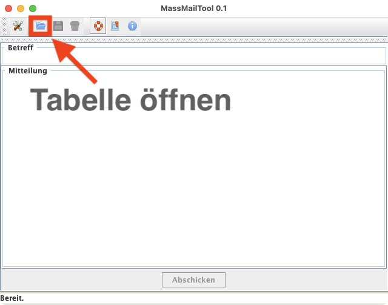
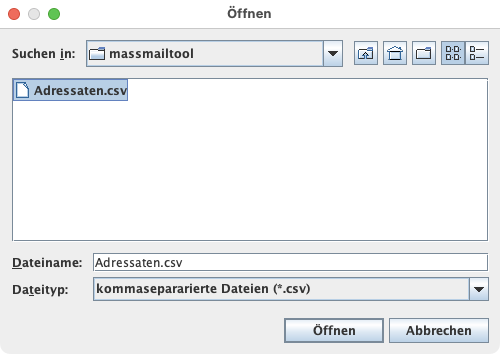
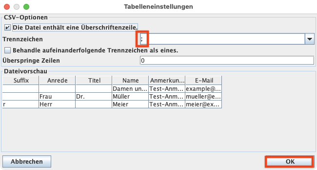
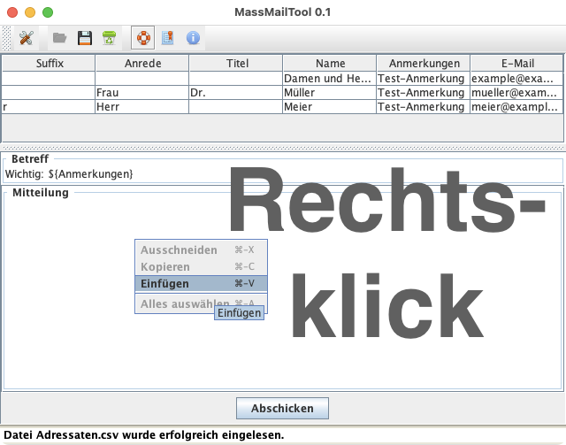
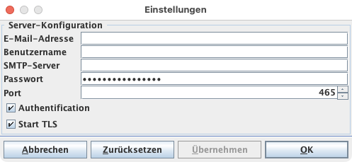
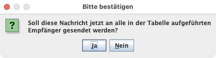
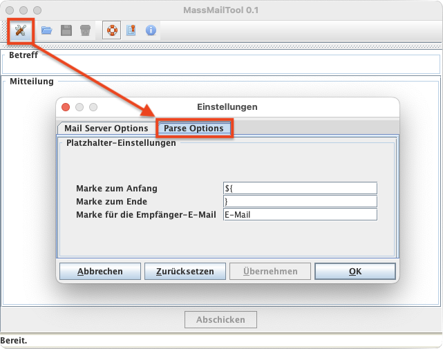

# MassMailTool
Ein nützliches eigenständiges Programm, um ähnliche E-Mails an zahlreiche Empfänger zu senden.

[](http://opensource.org/licenses/MIT)
[](https://github.com/draeger/MassMailTool/releases/)
[](https://zenodo.org/badge/latestdoi/576765843)


*Author:* [Andreas Dräger](https://github.com/draeger)

________________________________________________________________

# Kurzanleitung

## Herunterladen

Die jeweils neueste Programmversion findet man [hier](https://github.com/draeger/MassMailTool/releases).

Herunterladen kann man das Programm als ausfürbare JAR-Datei (Java Archive) mit folgendem Namensschema: `massmailtool-<Programmversion>-full.jar`.

## Das Programm starten

Die heruntergeladene JAR-Datei kann man direkt durch einen Doppelklick ausführen.
Sollte sich das Programm nicht durch Doppelklick starten lassen, muss ggf. zunächst Java installiert werden, was [hier](https://jdk.java.net/19/) für frei verfügbar ist.

Alternativ kann man das Programm in einer Kommandozeile (wie der Windows-Eingabeaufforderung) folgendermaßen starten:
```
java -jar target/massmailtool-<Programmversion>-full.jar
```
(wobei `<Programmversion>` durch die aktuelle Versionsnummer ersetzt werden muss.)
Unter Windows müsste man statt `java` den Befehl `javaw` aufrufen, damit die graphische Oberfläche des Programms gestartet wird.

## Eine Beispiel-Tabelle erstellen und einlesen

In einem Tabellen-Kalkulationsprogramm wie Microsoft Excel, Apple Numbers, oder LibreOffice Calc erstellen wir eine beliebige Tabelle, deren Zeilen jeweils einen Empfänger repräsentieren.
Die Spalten können wir willkürlich aber eindeutig bezeichnen. Wichtig ist, dass eine Spalte vorhanden sein muss, in der je eine E-Mail-Adresse hinterlegt ist, an die die Nachricht gesendet werden soll.
Hier ein Beispiel für eine solche Tabelle:

| Suffix | Anrede | Titel | Name             | Anmerkungen            | E-Mail              |
|--------|--------|-------|------------------|------------------------|---------------------|
|        |        |       | Damen und Herren | Das müssen Sie wissen. | leute@example.com   |
|        | Frau   | Dr.   | Müller           | Das ist ein Fakt.      | mueller@example.com |
| r      | Herr   |       | Meier            | Haben Sie das gehört?  | meier@example.com   |

Es müssen also nicht immer alle Tabellenfelder gefüllt sein. Leere Einträge können ebenfalls wichtig sein, wie bei den "Damen und Herren".

Damit die Tabelle im MassMailTool eingelesen werden kann, muss sie als CSV-Datei (engl. _Character-Separated Value_) exportiert werden. Dazu gehen wir folgendermaßen vor:

* Microsoft Excel: "Datei > Speichern unter" und im Speicherdialog auf CSV-Dateien einstellen.
* Apple Numbers: "Datei > Exportieren > CSV..." und Dialogfenster den Speicherort auswählen.
* LibreOffice Calc: analog zu Excel

Obige Beispieltabelle gibt es [hier](https://raw.githubusercontent.com/draeger/MassMailTool/main/src/test/java/org/draeger/massmailtool/Adressaten.csv) zum Herunterladen.

**☞ Hinweis:** Die Spaltennamen können zwar frei gewählt werden, sollten aber sicherheitshalber keine Leerzeichen enthalten. Notfalls können Unterstriche einzelne Wörter miteinander verbinden.

Nach dem Start des MassMailTools kann die eben erstellte CSV-Datei durch eine der folgenden Aktionen öffnen:
* mit der Tastenkombination Strg + O (Windows und Linux) bzw. Cmd + O (unter macOS)
* Datei > Öffnen in der Menüleiste
* ein Klick auf das Öffnen-Symbol in der oberen Leiste:


Anschließend wählt man die zu öffnende Datei aus:



Eine Beispieldatei gibt es [hier](https://raw.githubusercontent.com/draeger/MassMailTool/main/src/test/java/org/draeger/massmailtool/Adressaten.csv) zum Herunterladen.

Danach erscheint ein Dialog mit einer Vorschau der einzulesenden Daten und Einstellungsmöglichkeiten, um das Verhalten beim Lesen der Datei zu beeinflussen.



Die Schaltfläche "OK" schließt den Vorgang ab.

Die Tabelle erscheint daraufhin im oberen Bereich des Fensters, wo alle Werte verändert und die Spalten getauscht werden können – nicht jedoch der Tabellenkopf.

Im Weiteren Verlauf gilt stets der aktuelle Inhalt der Tabelle. Es werden also alle hier durchgeführten Änderungen berücksichtigt.

## Eine E-Mail mit Platzhaltern erstellen

### Was sind Platzhalter?

Platzhalter sind Variablen im Text, die anhand der Werte aus der Tabelle gefüllt werden.
Die Tabellenüberschriften bestimmen, aus welcher Spalte ein einzufüllender Wert entnommen werden soll.
Für jede Tabellenzeile entsteht dadurch eine eigene E-Mail.

Wie ein Platzhalter aussieht, lässt sich in den Einstellungen frei festlegen.
Voreingestellt ist folgendes:
* Ein Platzhalter beginnt mit der Markierung `${` und endet mit der Markierung `}`. Beides kann in den Einstellungen geändert werden, z.B. zu `[*` und `*]` oder beliebigen anderen Werten, falls dies für den Text sinnvoll ist.
* Zwischen der Marke für Beginn und Ende kann jeweils nur eine Bezeichnung aus dem Tabellenkopf stehen.

**☞ Beispiel:** Anhand der Voreinstellungen und obiger Tabelle würde ein im Text auftretender Platzhalter `${Name}` in der ersten E-Mail durch "Damen und Herren", in der zweiten E-Mail durch "Müller" und in der dritten E-Mail durch "Meier" ersetzt werden.

Die obige Tabelle erlaubt uns also, folgende Platzhalter zu benutzen (wenn man von den voreingestellten Markierungen für Beginn und Ende ausgeht):
`${Suffix}`, `${Anrede}`, `${Titel}`, `${Name}`, `${Anmerkungen}`, `${E-Mail}`.
Wir sind aber frei in der Beschriftung des Tabellenkopfes, sodass es beliebige Platzhalter geben kann – je nachdem, was wir für unsere Serienmitteilung benötigen.

Platzhalter dürfen sowohl im Betreff als auch im Nachrichtentext vorkommen.
Die Platzhalter werden unmittelbar vorm Versenden der Nachricht ersetzt.

### Wie gebe ich eine vollständige E-Mail ein?

Der Betreff der zu versendenden E-Mail wird in einem entsprechenden Textfeld unter der Tabelle eingegeben.

**☞ Beispiel:** `Wichtig: ${Anmerkungen}`

Im größeren Kasten mit der Beschriftung "Mitteilung" wird der Nachrichtentext eingegeben.
Hier ein Beispiel, das die in obiger Tabelle definierten Spaltennamen nutzt:
```
Sehr geehrte${Suffix} ${Anrede} ${Titel} ${Name},

hiermit möchte ich Sie freundlich auf den wichtigen Sachverhalt hinweisen und
Sie bitten, diesen zur Kenntnis zu nehmen: ${Anmerkungen}.

Daran, können Sie, werte${Suffix} ${Anrede} ${Titel} ${Name}, gut
die Wichtigkeit des Themas erkennen.

Insbesondere wären mir folgende Aspekte besonders wichtig.

Mit freundlichen Grüßen
Ihr Artur Absender

Signatur
```
Durch das Suffix wird aus "geehrte" hier nach Bedarf "geehrter", indem durch den Platzhalter `${Suffix}` ein "r" angehängt wird.

**☞ Hinweis:** Wenn beim Ersetzen von Platzhaltern mehrere aufeinanderfolgende Leerzeichen entstehen, werden diese gelöscht.
Die derzeitige Implementierung ersetzt dazu grundsätzlich aufeinanderfolgende Leerzeichen durch ein einziges. Dadurch können allerdings gewollte Einrückungen in der Nachricht verloren gehen.

**☞ Auswählen, Kopieren, Einfügen, Ausschneiden von Text:**
Je nach Betriebssystem können für diese Aktionen unterschiedliche Tastenkombinationen genutzt werden, die sich sowohl auf Einträge in der Tabelle als auch in den Textfeldern für Betreff und Mitteilung beziehen. Sollten diese Aktionen nicht wunschgemäß funktionieren, genügt ein Rechtsklick. Daraufhin erscheint ein kleines Dialogfenster, das die entsprechende Aktion durch einen Linksklick ausführt.



**☞ Hinweis:** Bevor Sie loslegen, erstellen Sie sich lieber eine kleine Tabelle, deren E-Mail-Spalte nur Ihre eigene Adresse enthält. So können Sie ausprobieren, ob in Ihrer Mitteilung alle Platzhalter korrekt ersetzt, und die Nachricht wie gewünscht versendet wird. Ist der Probelauf erfolgreich, können Sie mit der eigentlichen Tabelle arbeiten.

### Wie versende ich den Text an alle Empfänger?

Über der Statusleiste befindet sich eine Schaltfläche mit der Beschriftung "Abschicken".
Wird diese betätigt, so geht das Programm zeilenweise durch die Tabelle und ersetzt pro Zeile alle Platzhalter in Betreff und Nachrichtentext anhand der Werte in der aktuellen Tabellenzeile.

Damit die Nachrichten versendet werden können, muss jedoch der E-Mail-Server eingestellt sein.
Sollte dies noch nicht in den Einstellungen vorgenommen worden sein, wird dazu ein eigenes Dialogfenster geöffnet, in das die Verbindungsdaten eingetragen werden müssen.
Mit einem Klick auf die "OK"-Schaltfläche werden die Daten gespeichert.



Weil der Versand an viele Empfänger auch zu Versehen und Fehlern führen kann, fragt das Programm noch einmal kurz nach einer Bestätigung, bevor die individuellen Mitteilungen generiert und endgültig versendet werden.



**☞ Hinweise:**
* Die aktuelle Implementierung unterstützt ausschließlich SMTP-Server, kein POP3.
* E-Mail-Server mit 2-Faktor-Authentifizierung (wie GMail von Google) funktionieren wahrscheinlich nur dann, wenn die Sicherheitseinstellungen reduziert werden, also die 2-Faktor-Authentifizierung ausgeschaltet wird. Davon ist jedoch abzuraten. Solche E-Mail-Konten sollten hierfür besser nicht verwendet werden.
* Die hier eingegebenen Daten werden ausschließlich lokal gespeichert. Der genaue Speicherort hängt vom Betriebssystem ab. In Windows dient dazu ein eigener Bereich in der Windows-Registry. In Linux und macOS werden dazu bestimmte Konfigurationsdateien angelegt. Da der genaue Speicherort vom Betriebssystem festgelegt wird, hat dieses Programm darauf keinen Einfluss. Garantiert ist, dass keine Daten außerhalb des eigenen Rechners gespeichert, noch an Dritte übertragen werden.

### Was wenn meine Tabelle keine Spalte mit der Bezeichnung "E-Mail" enthält?

Das Schlüsselwort "E-Mail" kann frei verändert werden. Wichtig ist, dass es eine Spalte gibt, die (in der aktuellen Implementierung) jeweils genau eine E-Mail-Adresse pro Zeile enthält, an die eine Nachricht gesendet werden soll.

Um den Tabellenkopf dieser Spalte als Schlüsselwort festzulegen, genügt ein Klick auf das Werkzeugsymbol in der oberen Leiste. Im daraufhin angezeigten Dialogfenster "Einstellungen" wählt man den Reiter "Parse Options" aus, wo sich sowohl die Marken für die Platzhalter als auch die Marke für die Tabellenspalte mit der E-Mail-Adresse der Empfänger ändern lässt.



Der Einstellungsdialog kann durch einen Klick auf "Zurücksetzen" alle Standardwerte wieder herstellen, wobei jedoch auch die E-Mail-Einstellungen verloren gehen.

## Weitere Programmfunktionen

* Speichern: Änderungen in der Tabelle können in einer CSV-Datei gespeichert werden. In der aktuellen Implementierung gehen jegliche Änderungen am E-Mail-Text oder Betreff mit dem Schließen des Programms verloren. Sollten wichtige Änderungen durchgeführt worden sein, so empfiehlt es sich, diese zu kopieren und in einer Textdatei zu hinterlegen.
* Schließen: Hiermit wird die geöffnete Tabelle geschlossen, damit eine andere geöffnet werden kann.
* Hilfe anzeigen: Eine Übersicht über Kommandozeilen-Optionen erscheint. Diese wirken sich nur dann auf das Programm aus, wenn es nicht per Doppelklick, sondern per Kommandozeile gestartet wird.
* Lizenz anzeigen: Es erscheint ein Dialogfenster mit Informationen zur Lizenz, unter der dieses Programm bereitgestellt wird (auf Englisch).
* Informationen anzeigen: Ein Dialogfenster zeigt, wann und von welchen Autoren dieses Programm erstellt wurde.
* Statusleiste aus- oder wieder einblenden: im Menü unter Ansicht > Status-Leiste
* Zuletzt geöffnete Datei erneut öffnen: im Menü unter Datei > Zuletzt verwendet merkt sich das Programm bis zu zehn zuvor geöffnete CSV-Dateien, die dort mit einem Klick ausgewählt und erneut eingelesen werden können, wodurch man sich das Suchen der Datei im Auswahldialog erspart. Noch praktischer sind die dafür vorgesehenen Tastenkombinationen von Alt + 1 bis Alt 0, die jeweils auf eine Datei in der entsprechenden Reihung verweisen, sofern zuvor etwas geöffnet wurde.

## Programm beenden

Um das Programm vollständig zu beenden, genügt entweder
* ein Klick auf das Schließen-Symbol im Fensterrahmen
* je nach Betriebssystem eine Tastenkombination wie Alt + F4 oder Command + Q
* ein Klick auf den entsprechenden Eintrag in der Menüleiste.

**☞ Hinweis:** Das Programm speichert automatisch Einstellungen, die im Dialog mit dem Werkzeugsymbol eingegeben wurden sowie weitere Eigenschaften wie Größe und Position des Fensters sowie die zehn zuletzt geöffneten CSV-Dateien. Nicht gespeicherte Änderungen, die in der Tabelle vorgenommen wurden, oder auch jeglicher in den Textfeldern eingegebener E-Mail-Text oder Betreff, gehen in der aktuellen Implementierung jedoch unwiederbringlich verloren.

## Fehler melden oder neue Funktionen vorschlagen

Sollte einmal etwas nicht korrekt funktionieren oder Ideen für neue Funktionen bzw. Verbesserungsvorschläge aufkommen, können diese [hier](https://github.com/draeger/MassMailTool/issues) gemeldet werden, indem auf die Schaltfläche "New issue" geklickt wird.

# Hauptentwickler

[Dr. Andreas Dräger](https://github.com/draeger)
